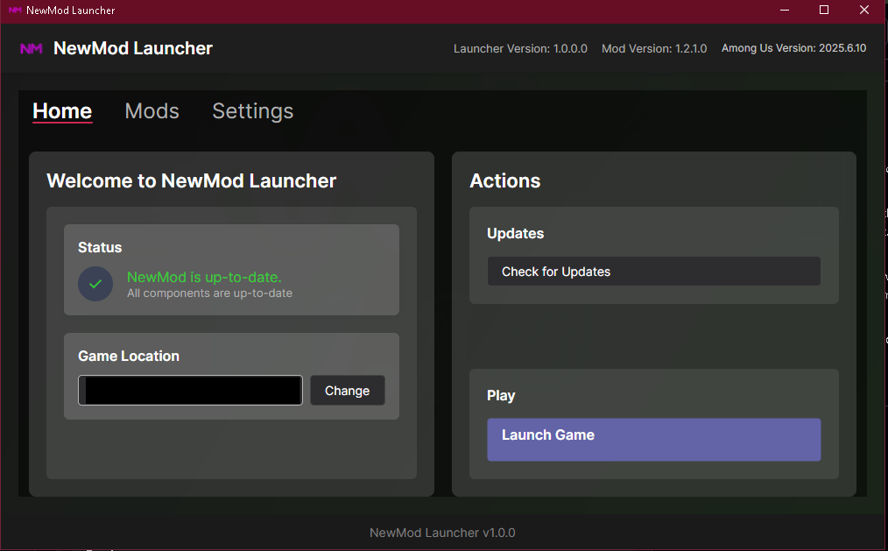
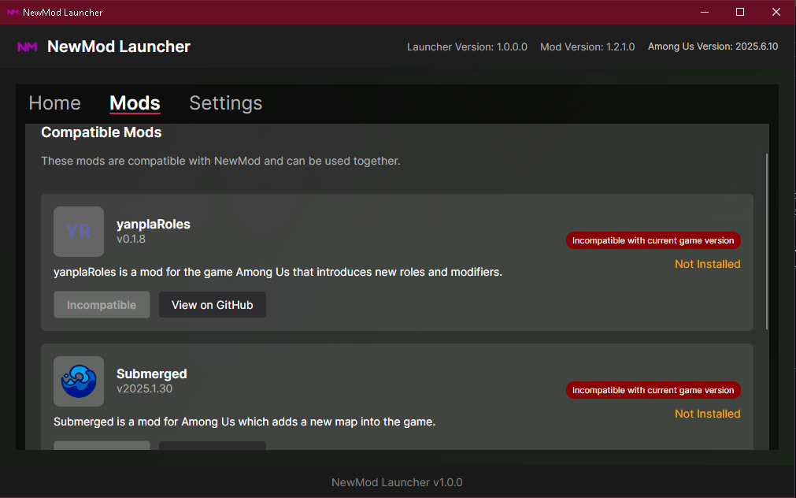
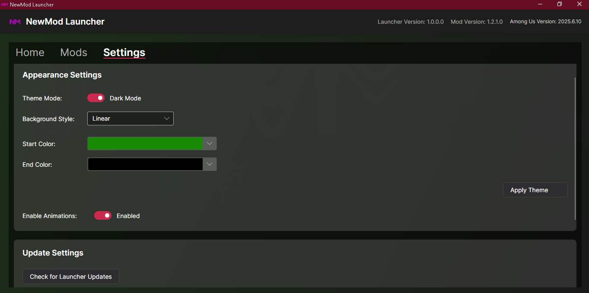

# 🚀 NewMod Launcher

Welcome to the **official launcher** for [NewMod](https://github.com/CallOfCreator/NewMod) — A simple and modern, easy-to-use launcher designed for NewMod and its compatible mods.
This launcher provides a seamless way to manage, update, and launch NewMod without any hassle.

---

### 📸 Preview

> A look at the NewModLauncher:





---

## 📦 Features

- ✅ **Auto-installs** NewMod to your Among Us folder (custom path supported)
- 🥉 **Auto-checks** for updates for NewMod and its dependencies
- 🎮 **Mod Tab:** Automatically manage, download, and update compatible mods
- ☁️ **Beta Testers Tab**: Access nightly builds of NewMod *(coming soon)*
- 🎨 **Modern UI** built with Avalonia
- ⚙️ **Settings:** Enable gradients, switch themes, and more…

---

## 🛠️ How to Use

1. **Download** the latest version of the launcher from the [Latest](https://github.com/CallOfCreator/NewModLauncher/releases/latest) page

2. **Launch** the executable

3. **Select** your Among Us directory  
   > 📝 *The launcher will try to auto-detect your last played Among Us location. You can change it manually if needed.*
   
4. **Wait** for the launcher to finish downloading.  
   > 📝 Once the download is complete, you should see the mod version updated

5. **Play** with the "Launch" button! 🎉

---

## 💁‍♂️ Folder Structure

```bash
NewModLauncher/
├── NewModLauncher.exe
├── Data/
│   └── config.json
└── launcher.log

```

---

## ❓ Frequently Asked Questions (FAQ)

---

### 💻 Q1: I'm seeing Windows Defender SmartScreen block the NewMod Launcher from executing. What should I do?

> 🚫 **This is a false positive.**  
> I've already submitted the launcher to Microsoft for review via their official analysis process.  
> ✅ Once it's approved, I'll post an announcement in the Discord server.  
> 🔐 In the meantime, you can safely allow the launcher through Defender by choosing:  
> **"More info" → "Run anyway"**

---

### 🧩 Q2: The Launcher opened with a "Ready To Play" message, but version shows V1.0.0 and Among Us version is empty?

> 🛠️ Sometimes, the launcher malfunctions on startup.  
> To fix this, follow these steps:
> 1. ❌ **Close the Launcher**
> 2. 🗑️ **Right-click the `Data` folder and click Delete**  
>    🔔 *Note:* Deleting `config.json` inside the Data folder will remove your preferred gradient theme.  
>    💾 You can back it up and reapply it later.
> 3. 🔁 **Reopen the Launcher**

---

### 💥 Q3: The Launcher crashed with an unexpected error. What should I do?

> 🧾 If the launcher crashed:
> - 📤 Submit an issue on **GitHub** or in the **Discord server**
> - 📎 Attach the following files:
>   - `crash.log`
>   - `launcher.log`

---

## Credits
- [Avalonia UI](https://github.com/avaloniaui/Avalonia): **The framework used by the launcher**
- [Reactor](https://github.com/NuclearPowered/Reactor): **Used to download and manage the core dependency for NewMod.**
- [MiraAPI](https://github.com/All-Of-Us-Mods/MiraAPI): **Used to download and manage the main dependency for NewMod.**
- [Daemon](https://github.com/DaemonBeast): **Author of the Among Us version detection code**

---

### 📜 License

This project is licensed under the **GNU General Public License v3.0**.  
For more information, see the [LICENSE](./LICENSE) file.
